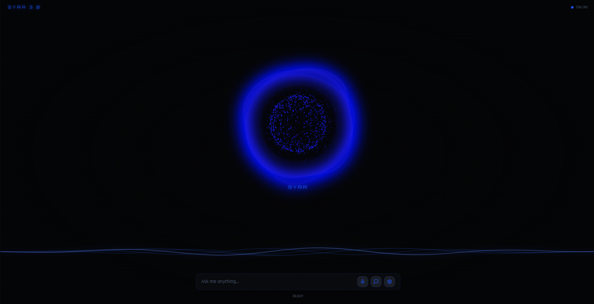

# SYRA 3.0 — AI Assistant Interface

<p align="center">
  
</p>

<p align="center">
  <strong>A futuristic web interface for the SYRA personal AI assistant system.</strong>
</p>

<p align="center">
  
  
  
  
  
</p>

---

## Overview

**SYRA 3.0** is a futuristic AI assistant interface designed to become the central command center of a personal intelligent assistant system.

The interface focuses on a minimal, immersive and futuristic experience with:

- Dark command-center inspired UI
- Animated central AI core
- Voice interaction controls
- Text-based assistant input
- System status indicators
- Futuristic blue neon visual language
- Expandable architecture for future AI integration

The long-term goal is to connect this interface with the SYRA assistant backend, allowing users to communicate with the assistant through voice and text.

---

## Features

### Current Interface

- Futuristic dark-themed dashboard
- Animated SYRA central core
- Assistant status indicator
- Text input for user commands
- Microphone interaction button
- Chat interface button
- Settings control
- Responsive layout
- Neon blue visual effects

### Planned Features

- Wake-word activation  
  Example: `Wake up SYRA`

- Voice command recognition
- AI-generated responses
- Integrated terminal view
- Application launching through voice commands
- Open VS Code, Chrome, YouTube and other applications
- File and folder creation through commands
- Personal schedule integration
- System monitoring
- Smart task management
- Local computer automation
- Connection with the SYRA Python backend

---

## Technology Stack

| Technology | Purpose |
|------------|---------|
| React | User interface |
| TypeScript | Type-safe development |
| Vite | Development and build tool |
| Tailwind CSS | Styling and layout |
| React Router | Application navigation |
| Lucide React | Interface icons |
| Vitest | Testing |
| Playwright | Browser testing |

---

## Project Structure

```text
SYRA_UI_Web/
│
├── public/
│   └── syra-preview.png
│
├── src/
│   ├── components/
│   ├── pages/
│   ├── assets/
│   ├── hooks/
│   ├── lib/
│   ├── App.tsx
│   ├── main.tsx
│   └── index.css
│
├── package.json
├── vite.config.ts
├── tailwind.config.ts
├── tsconfig.json
└── README.md
```

---

## Getting Started

### 1. Clone the repository

```bash
git clone https://github.com/v-aryank/SYRA_UI_Web.git
```

### 2. Enter the project directory

```bash
cd SYRA_UI_Web
```

### 3. Install dependencies

```bash
npm install
```

### 4. Start the development server

```bash
npm run dev
```

The application will be available at:

```text
http://localhost:5173
```

---

## Available Commands

```bash
npm run dev
```

Starts the development server.

```bash
npm run build
```

Creates a production build.

```bash
npm run preview
```

Previews the production build locally.

```bash
npm run lint
```

Checks the project for linting issues.

```bash
npm run test
```

Runs the test suite.

---

## Design Philosophy

SYRA is designed around the idea of a personal intelligent command center.

The interface uses:

- Minimal visual distractions
- Dark background
- Electric blue highlights
- Centralized AI visualization
- Clear system status
- Smooth interaction
- Futuristic control-room aesthetics

The goal is to make the assistant feel less like a traditional application and more like an intelligent system.

---

## Roadmap

- [x] Initial SYRA interface
- [x] Central AI core visualization
- [x] Text command input
- [x] Basic system status display
- [ ] Voice interaction
- [ ] Wake-word detection
- [ ] AI backend integration
- [ ] Integrated terminal
- [ ] Desktop application control
- [ ] Personal schedule assistant
- [ ] System monitoring dashboard
- [ ] Full SYRA ecosystem integration

---

## Related Project

This interface is part of the larger **SYRA Personal AI Assistant Ecosystem**.

The complete system is planned to include:

- AI conversation
- Voice recognition
- Text-to-speech
- Desktop automation
- Personal productivity tools
- Smart scheduling
- Embedded and IoT integration
- Local system control

---

## Author

**Aryan Kabir**

Electrical Engineering Student • Web Developer • AI/ML Enthusiast

- GitHub: [@v-aryank](https://github.com/v-aryank)
- Portfolio: [Aryan Kabir](https://arythic.vercel.app)

---

## License

This project is currently under development.

All rights reserved unless otherwise stated.